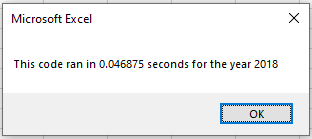
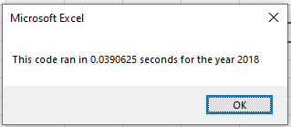

# stocks-analysis
Stock Analysis for several green energy stocks
## Overview of Project
To take existing code from the client and refactor(edit) the code to improve the speed of the analysis
## Results
As you can see from the screenshots below the you can see that the original code produced a time of 0.046875 where as the refactored code produced a time of 0.0390652 which is faster
#### Original code time

#### Refactored code time

## Summary 
There are advantages for refactoring code. one advantage is that someone else has done most of the work for you and all you have to to is edit the code to your liking. However a disadvantage of using someone elses code is that you may not understand the logic especially if it is not well documented. Another disadvantage is that the code may not be correct and you could spend hours debugging the code just to get it to work in your application. 

The advantage of the original script is that it was worked and was it did not need to be debugged. The disadvantage was that it still needed edits to display the outputs. The advantage of the refactored code was that it was faster and displayed exactly what the client was looking for. The disadvantage was the time need to make the edits and to understand was the original code was doing before editing could begin. 
